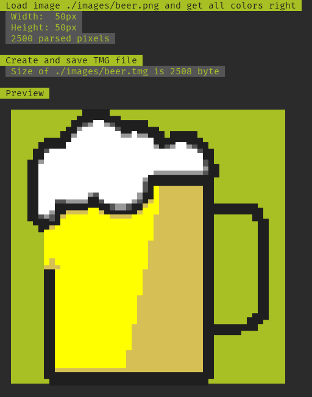
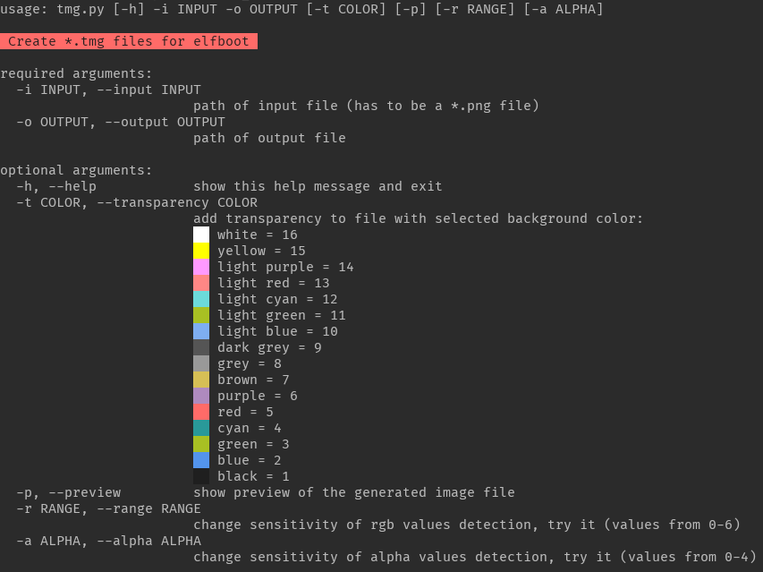

# Text Mode Graphic [TMG]

## Image file format for [elfboot](https://github.com/croemheld/elfboot)
elfboot is a bootloader for the x86 architecture which uses VGA video mode 3 for displaying information. Since a bootloader usually resides in the first 64 KB of memory, loading and displaying images might waste precious memory.
The TMG project aims to drastically reduce image files by only using the [16 available colors](https://wiki.osdev.org/Printing_To_Screen#Color_Table) in VGA video mode 3 and the ASCII/Code Page 737 character 220 (bottom half block &lhblk; ).

#### Basic idea:
Usually, VGA video mode 3 uses 9x16 pixels for each glyph. Since an image consists of square pixels, we use the &lhblk; glyph to cover half of the area, which results in two vertically stacked pixels. By using the attribute byte of screen character, we can color both "pixels" by defining the foreground color for the bottom and the background color for the top half of the glyph.

```
 __________________ __________________ _____ _ _
|                  |                  |
|                  |                  |
|                  |  ██████████████  |
|                  |        ██        |
|    Background    |        ██        |
|                  |        ██        |
|                  |        ██        |
|__________________|        ██        |
|██████████████████|        ██        |
|██████████████████|        ██        |
|██████████████████|        ██        |
|█ Code Page 737 ██|                  |
|█ Character 220 ██|                  |
|██████████████████|                  |
|██████████████████|                  |
|██████████████████|__________________|_____ _ _
```

#### Further additions:
A new approach has been developed to support transparent images
[alpha color is set in the image creation process and thereafter set in the file header]:
- Both blocks (top and bottom) transparent: 
    - background color = alpha color
    - foreground color = black
    - ASCII character 32 (Space)
- Upper block transparent
    - background color = alpha color
    - foreground color = color of the pixel
    - ASCII character 220 ( &#9604; )
- Lower block transparent
    - background color = alpha color
    - foreground color = color of the pixel
    - ASCII characters 223 ( &#9600; )
- Both blocks have the same color (not transparent):
    - background color = alpha color
    - foreground color = color of the pixels
    - ASCII character 219 ( &#9608; )
- Both blocks have different colors (not transparent)
    - background color = color of the upper pixel
    - foreground color = color of the lower pixel
    - ASCII character 220 ( &#9604; )


#### TMG File schematic: 
- Mode: 0 or 1
    - 0: smaller image size, no transparency and no ascii values in body
    - 1: bigger image size, transparency and ascii values in body
- Alpha_Color: color value
- Width: pixel width of the picture
- Height: pixel height of the picture

```
HEADER (8 Byte)
+-----------------------------------------------------------+-------------------+
| "TMG"                                                (3B) | Version      (1B) |
+-------------------+-------------------+-------------------+-------------------+
| Mode         (1B) | Alpha_Color  (1B) | Width        (1B) | Height       (1B) |
+-------------------+-------------------+-------------------+-------------------+

BODY (mode = 1)  
+-------------------------------------------------------------------------------+
| dc fc dc ff dc a3 ...                                                         | 
|                                                                               |
|                                                                               |
+-------------------------------------------------------------------------------+
```

`dc ff dc ff dc a3` <- this are six pixel   
   
`dc` <- 220 <- ascii value: &lhblk;   
`fc` <- `f`: 15 = white background, `c`: 12 = light red foreground (&lhblk;)   
   
... 

#### Example   
This _beer_ image is from the fantastic [*openmoji*](https://openmoji.org/library/#search=beer&emoji=1F37A) *(License: [CC BY-SA 4.0](https://creativecommons.org/licenses/by-sa/4.0/))* project:    
   
   
   

#### How to use tmg.py:


##### Requirements: 
- python3   
- pip3: [pillow](https://python-pillow.org/)

